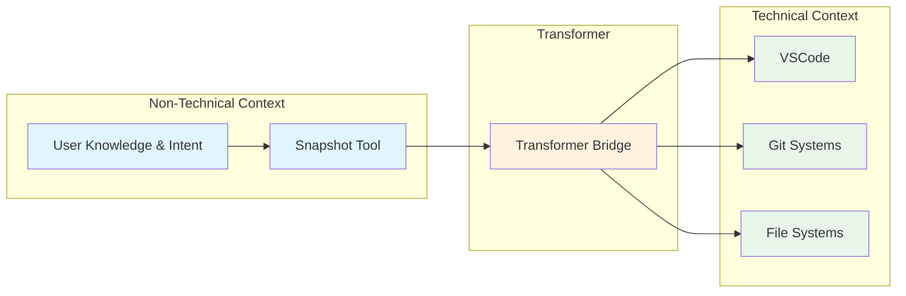

# Transformer

A tool for semi technical works to track, manage and complete work with AI, either by themselves, or with their coworkers

## Vision & Philosophy

Transformer accomplishes its goals by being:

- Calm and relaxed in its approach
- Static and mechanical in its operations
- Simple and coherent in its design
- Flowing and stress-free in its user experience

## Why VSCode

VSCode has proven itself as the foundation for complex workflows across the software industry. Its intuitive interface combined with extensive customization capabilities makes it an ideal platform for both technical and semi-technical work. The editor's rich ecosystem of extensions and strong market presence has led to numerous AI-integrated forks and variations, capturing a significant share of the development tools market. This widespread adoption and adaptability makes it the perfect platform for bridging traditional development workflows with emerging AI-powered productivity tools.

#### What exactly are we transforming

Each domain serves a specific purpose:

- `Non-Technical Context`: Capture immediate context/intent
- `Transformer`: Visual representation of relationships/plans
- `Technical Context`: Professional-grade content organization

The magic is in the automatic translation between domains:

- User Knowledge → Snapshot Tool (AI interprets context)
- Snapshot Tool → Transformer Bridge (structures the relationships)
- Transformer Bridge → VSCode (professional storage)
- Transformer Bridge → Git Systems (version control)
- Transformer Bridge → File Systems (professional storage)

It's simple because each translation is natural:

- Users think in knowledge and intent
- VSCode thinks in files and trees
- Git thinks in changes and history
- AI thinks in natural language

The UI just needs to facilitate these translations while keeping the complexity hidden.

These are lofty goals, yet we have stable foundations through:

- VSCode and Git
- Electron and Node
- Mac and Windows support

## Core Concepts

### Snapshots

The foundation of Transformer is the Snapshot tool - a general purpose context capture tool that will eventually cover multiple modalities:

- Text
- Voice
- Screen
- Video (future)

Snapshots produce special files with the `trans://` protocol that are opened in Transformer. These trans files:

- Are artifacts in our git subtrees
- Guide key processes and subsystems
- Are MDX files mixing markdown and XML
- Can compose other trans files via JSX (no React, just compositional JSX)

### Context Management

Snapshots feed into a sophisticated context management system:

- Users explicitly control when to input and query the system
- Queries can be global to a project or granular
- Tied to VSCode's ContextKeyService
- Snapshot builders provide UI around Snapshot services

### Architecture

Transformer is built on nuanced layers of abstraction:

- Services
- Interfaces
- Layers
- Designed for semi-technical community extension

It flows towards plain yet powerful technologies:

- Git
- VSCode
- ContextKeyService integration
- SnapshotQueryInputService
- SnapshotQueryIntent objects

This architecture enables rich workflows involving AI assistants provided by Transperfect, powering both internal teams and customers.

#### Motivation

lets image the employee is a Program Manager, she logs in

she has a bunch of emails from her clients

and her coworkers

and they are collaborating on client projects

she might have one from her boss about a new client

she might be collaborating with her peers on a new program management iniative

she will have questions, she will be catching up with threads and synthesizing new information

she will in other words be consuming content, mostly by reading it and looking at visuals and then meeting and talking with others about what she has seen

she will be obliged to produce content

meaning she will be obliged to respond to client questions and really all sorts of questions

there will be so many questions

she will know answers to these with different degrees of certainity

in other words she will create an dependency chain, a tree

there will be some leaves that actually can be plucked right from the trunk

e.g. a client could ask a clear question about receipt of something and that just needs simple acknowledgement

it requires no checks with other sources of information, or checking reference material, older context from emails

it requires no real consideration of HOW to respond

she can just say "yes we received that and it looks great, thanks!"

however some of the other emails, will have varying branches, some with single chains resulting in one leave

meaning first I need to check this, and now yes I can reply

or first I need to check this, and then check this and then check this and then I can reply

however, some that set off a bunch of other branches, that split off

and those can be broken into 2 main categories

there is the case when she might need to branch off some parallel workflows which she ultimately intends to merge into a single answer but has to set off a complex branches of actions, all which ultimately result in one meaured answer, one leaf, all as we have seen before

however, in the other reasons to do this level of extensive branching is because what she has read has told her that she should be setting multiple new branches of work, simple new tasks with their own independent workflow

it is interesting to ask what would be the ideal professional tool on which to builid both a visualization of this for her and a means for her to advance through the tree

on top of a vscode fork, a bit of a weird thing to interject but I am confident it is the right platform for numerous reasons

on top of git, because let's face it, git is the right way to manage content

she needs a central view and herself or an AI agent should be able to advance down the branches, pruning them, plucking, finishing, removing them

so...the solution must be static, safe, reversible, local, yet tied into her desktop

### Let's use Transformer

Let's now use imagine and see actual Mermaid graphs that Transformer can provide from Sarah's snapshot.

Let's break down what snapshots Sarah might take as she completes her tasks.

And how Transformer would interpret them and what are some example Mermaid diagrams it might show her.
