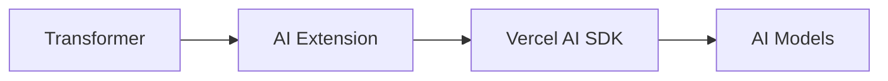

# Transformer AI Extension

This VSCode extension provides Transformer with AI capabilities delivered by the AI SDK from Vercel [here](https://sdk.vercel.ai/docs/getting-started/nodejs).

## How it Works

The extension integrates Transforer with Vercel's AI SDK to provide powerful AI capabilities:

## Usage

The extension automatically activates when Transformer starts. It provides:
- Integration with multiple AI providers (OpenAI, Anthropic, etc.)
- Streaming AI responses with efficient edge runtime support
- Type-safe interactions with AI models
- Easy switching between different AI models

## Development

1. Install dependencies: `npm install`
2. Build: `npm run compile`
3. Debug: Launch in VSCode's extension development host
