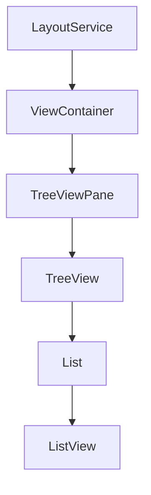

# VS Code Trees: A Developer's Quick Guide

A tree in VS Code consists of the following parts, layered like Russian dolls:

| Layer | Purpose | Notes |
|-------|---------|--------|
| ListView | Core virtualization engine | Handles scrolling and element recycling |
| List | Adds selection & keyboard nav | Wraps ListView with user interactions |
| TreeView | Tree-specific functionality | Handles hierarchy and expansion |
| TreeViewPane | Integration with VS Code | Auto-handles layout and containers |

## Key Architecture Points
Trees have two main integration paths:

1. **Standard Views**: Use `TreeViewPane` for automatic layout
   ```typescript
   class MyView extends TreeViewPane { ... }
   ```

2. **Custom Overlays**: Use `TreeView` directly but handle layout
   ```typescript
   this.treeView.layout(height, width);
   ```

## Connection to VS Code Architecture
Think of trees like pistons in an engine:
- LayoutService acts as the timing belt
- ViewContainers are the engine block
- Trees are the pistons that need precise synchronization

## Layout Flow


Each level synchronizes dimensions down the chain to keep scrolling smooth and virtualization accurate.

That's it. Trees are modular UI components that slot into VS Code's layout engine, either automatically via panes or manually in overlays.

## Critical Implementation Notes
1. Manual `TreeView` usage requires explicit layout calls
2. `TreeViewPane` handles layout automatically through inheritance
3. The LayoutService is key for dimension synchronization
4. CSS must support proper virtualization with explicit heights

Remember: When building custom tree UIs, either inherit from `TreeViewPane` for automatic layout management or handle layout calls manually with `TreeView`.
