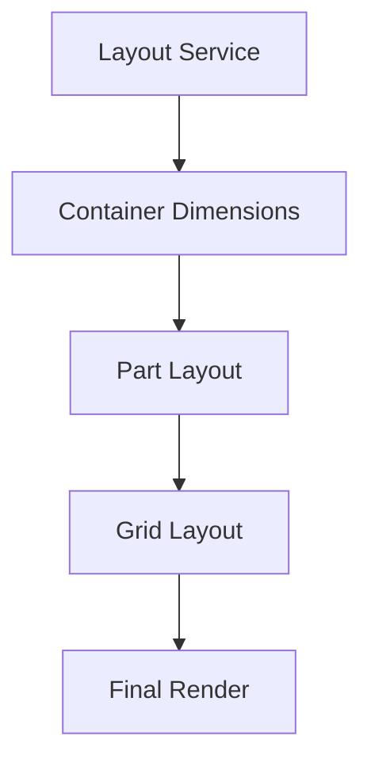

# VS Code Layout Service: Integration Guide

## Container Architecture

The Layout Service manages three key types of container measurements:

| Measurement | Purpose | Usage |
|------------|---------|--------|
| Dimensions | Current size | Layout calculations |
| Offsets | Positioning | UI element placement |
| Container State | Window tracking | Multi-window support |

## Integration with Parts

The Layout Service coordinates with VS Code's part system:

```typescript
interface Parts {
  TITLEBAR_PART
  BANNER_PART
  ACTIVITYBAR_PART
  SIDEBAR_PART
  PANEL_PART
  EDITOR_PART
  STATUSBAR_PART
}
```

## Layout Calculations



## Key Integration Points

1. **Container Initialization**
```typescript
// Get container for window
const container = layoutService.getContainer(window);

// Wait for styles
await layoutService.whenContainerStylesLoaded(window);
```

2. **Layout Management**
```typescript
// Get safe offsets
const { top, quickPickTop } = layoutService.activeContainerOffset;

// Listen for changes
layoutService.onDidLayoutContainer(({container, dimension}) => {
  this.layoutPart(container, dimension);
});
```

3. **Focus Management**
```typescript
// Focus primary part
layoutService.focus();
```

## Common Operations

| Operation | Description | Usage Note |
|-----------|-------------|------------|
| Container Access | Get window containers | Check window type first |
| Layout Events | Listen for changes | Consider disposal |
| Style Loading | Await styles | Required for aux windows |
| Dimension Access | Get current sizes | Cache when needed |

## Integration Tips

1. Always check container style loading before layout:
```typescript
const container = layoutService.getContainer(window);
await layoutService.whenContainerStylesLoaded(window);
// Now safe to do layout
```

2. Handle multi-window scenarios:
```typescript
layoutService.onDidChangeActiveContainer(() => {
  const activeContainer = layoutService.activeContainer;
  // Update for new active window
});
```

3. Consider offsets for UI elements:
```typescript
const { quickPickTop } = layoutService.activeContainerOffset;
// Position quick pick with correct offset
```

## Best Practices

1. **Container Lifecycle**
   - Track container disposal
   - Clean up event listeners
   - Handle window closure

2. **Layout Timing**
   - Wait for styles
   - Batch layout updates
   - Cache dimensions

3. **Window Management**
   - Check container validity
   - Handle focus changes
   - Support multi-window
