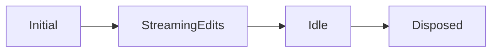

# Chat Editing Session Explained

Think of `ChatEditingSession` as a "workbench" where AI-suggested code changes are laid out before being permanently applied to your files.

## Core Components

| Component     | Purpose                          | Analogy                        |
| ------------- | -------------------------------- | ------------------------------ |
| Working Set   | Collection of files being edited | Like tabs open in your editor  |
| Edit Stream   | Incoming changes from AI         | Assembly line of modifications |
| State Machine | Tracks session status            | Traffic light system           |
| History       | Record of changes                | Git-like commit history        |

## State Flow

## Integration Points

| VS Code System    | How ChatEditingSession Uses It    |
| ----------------- | --------------------------------- |
| Bulk Edit Service | Applies changes to multiple files |
| Diff Editor       | Shows previews of changes         |
| Undo/Redo Manager | Tracks edit history               |
| File System       | Persists session state            |

## Key Operations

| Operation                       | What it Does                  | Similar To                |
| ------------------------------- | ----------------------------- | ------------------------- |
| `acceptStreamingEditsStart()` | Begins receiving AI edits     | Starting a git rebase     |
| `accept()/reject()`           | Commits/discards changes      | Staging/unstaging changes |
| `show()`                      | Displays changes in diff view | `git diff`              |

The session acts like a staging area between the AI's suggestions and your actual codebase, similar to how git stages changes before commit, but integrated with VS Code's editing and preview systems.
