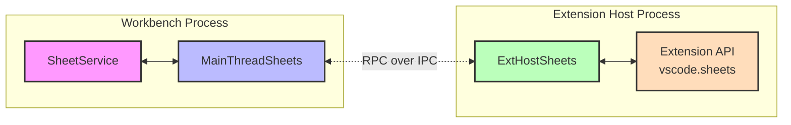

# Transformer Sheet

Transformer sheets is a contribution across VSCode that enables it to interact with spreadsheet-like data through extensions. This document explains the architecture, Typescript types, and intended usage this VSCode subsystem.

## Architecture Overview

Transformer sheets follows VS Code's extension architecture pattern:

1. Internal Workbench Service (SheetService)
2. Workbench proxy: MainThreadSheets
3. Extension host proxy: ExtHostSheets)



### Core Types

The sheet system maintains multiple parallel representations of its core types across different layers of the VS Code architecture. This design is intentional and follows VS Code's approach to duplicate and adapt to maintain explicit boundaries even at the cost of duplication and boilerplate.

#### Workbench Types (Internal)

The internal workbench implementation starts with the `SheetService` (registered as a VS Code workbench singleton in `workbench.web.main.internal.ts`). The service operates on these core types defined in `src/vs/workbench/services/sheet/common/sheet.ts`:

```typescript
interface SheetCell {
	row: number;
	col: number;
	value: any;
}

interface ISheetMutator {
	readonly extId: string;
	readCell(uri: URI, row: number, col: number): Promise<SheetCell>;
	writeCell(uri: URI, cell: SheetCell): Promise<void>;
	dispose(): void;
}
```

These types form the foundation of the sheet system within the workbench process. The `SheetService` implementation in `src/vs/workbench/services/sheet/browser/sheetService.ts` coordinates all sheet operations using these types.

An example usage in a run of the mill internal workbench VSCode action would look like:

```typescript

```
